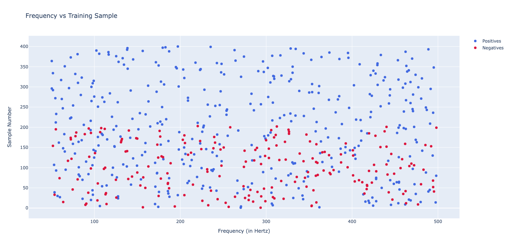

<!-- ABOUT THE PROJECT -->
## Classifying Continuous Gravitational Waves using Short Fourier Transforms Frequency Data

The continuous gravitational waves are weak but long-lasting signals emitted by rapidly spinning neutron stars. The neutron stars are extremely compacted stars spinning over 1,000 times per second. It is difficult to detect the continuous gravitational waves because the amplitude of the signals is very faint compared to the noise signals, 1 to 2 orders of magnitude lower. 

This project aims to detect these continuous gravitational-wave signals. We develop a model sensitive enough to detect weak yet long-lasting signals emitted by rapidly-spinning neutron stars within noisy data.

Frequency plot of input:



<!-- GETTING STARTED -->
## Getting Started

The scripts are organized into following parts:

1. Model generation: `generate_model.py`
2. Classification of test data: `classify.py`
3. Generating plots: `plots.py`

Besides the provided files, the train and test folders should contain the corresponding HDF5 data from Kaggle: 
[https://www.kaggle.com/competitions/g2net-detecting-continuous-gravitational-waves/data
](https://www.kaggle.com/competitions/g2net-detecting-continuous-gravitational-waves/data
)  

### Running the scripts

1. Setup virtual environment and install the packages:
    ```
    virtualenv venv
    source venv/bin/activate
    pip install -r requirements.txt
    ```

2. Generate SVM and Decision Tree classifier models:
    ```
    python generate_model.py
    ```

3. Classify the test data:
    ```
    python classify.py
    ```

4. Generating frequency plot:
    ```
    python plots.py
    ```